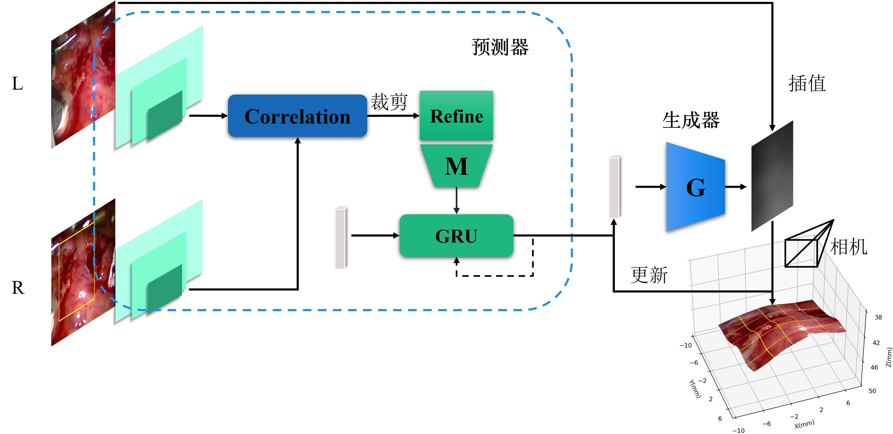
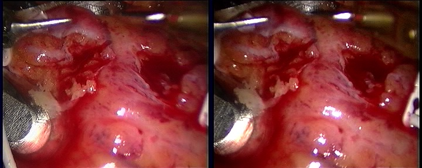
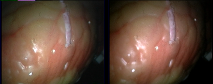

# PMG-Net

PyTorch implementation of my thesis's chapter3-4: 

**[PMGNet: Predictive-generative Network for Efficient 3D Reconstruction]()**

Authors: Guan Yao

I propose a complexed model for efficient disparity estimation of stereo-endoscopic images. 

## Overview

<p align="left"> 
 
</p>

We decompose our framework into two main components: 

**Predictor** and **Generator** 

Predictor contains Mapping network which consists of feature extraction, cost volume construction, cost aggregation from AANet and GRU module.

Generator uses a simplified synthesisNetwork of StyleGAN3.
  

### 1. Environment setup

Our code is based on Pytorch 1.9.0, CUDA 11.1, Python 3.9 and Ubuntu 18.04. 
We recommend using [conda](https://www.anaconda.com/distribution/) for installation: 
```shell
conda env create -f environment.yml
```
After installing dependencies, build deformable convolution:

```shell
cd aa_nets/deform_conv && bash build.sh
```
navigate to the project directory and set PYTHONPATH:
```
export PYTHONPATH=$PYTHONPATH:~/PMG-Net/aa_nets:~/PMG-Net/stylegan3/dnnlib:~/PMG-Net/stylegan3/torch_utils
```
see more at [AANet](https://github.com/haofeixu/aanet) and [StyleGAN3](https://github.com/NVlabs/stylegan3)

### 2. Dataset 
We use dataset of Heart motion as deformation model and test on [Endoscopic Video Datasets](http://hamlyn.doc.ic.ac.uk/vision/)
One should organize the video dataset as follows:

phantom dataset structure is same to above.
#### Dataset download
- [Invivo](http://hamlyn.doc.ic.ac.uk/vision/data/Dataset4/stereo.avi)

<p align="left">
 
</p>

- [Phantom L](http://hamlyn.doc.ic.ac.uk/vision/data/Dataset11/f5_dynamic_deint_L.avi) and [Phantom R](http://hamlyn.doc.ic.ac.uk/vision/data/Dataset11/f5_dynamic_deint_R.avi)

<p align="left">
 
</p>

#### Dataset preprocessing

we sampled first 700 frames from video and do stereo correction.

#### Dataset structure
```
invivo
|-- train
    |-- image_2
        |-- frame1.png
        |-- frame2.png
        |-- ...
    |-- image_3
        |-- frame1.png
        |-- frame2.png
        |-- ...
|-- test
```

### 3. Training
#### 3.1 train generator first
To train stylegan3, for example invivo dataset, run
```
python stylegan3/train.py --outdir=training-runs --cfg=stylegan3-t --data=datasets/invivo_disp_gt.npy --gpus=1 --batch=64 --gamma=8.2 --metrics=none
```
#### 3.2 fetch optimal w latents of training dataset of trained generator
check `stylegan3/GNet_train.py` line237, change 'test' to 'train' when generate w_opt^{train}, to 'robust_test' when test robustness.
```
python stylegan3/GNet_train.py --dataset=<dataset name> --model=sgan3 --mode=train_w
```
#### 3.3 train PMG-Net, for example: train model for invivo
```
# Train pmg for phantom.
python stylegan3/PMGNet_train.py --dataset=phantom --model=pmg --mode=test
```
### 4. Evaluation
We use RMSE of disparity estimation OVER 500 salient pixels and similarity measures (Loss_pho/PSNR/SSIM) between reconstruction right images and real right images in 100 test frames.

```
# Evaluation RMSE of disparity estimation of stylegan3 and output 3D figures for invivo.
python measure/visualize3d_and_calRMSE.py --model=sgan3 --dataset=invivo

# Similarity measures of stylegan3 for invivo.
python measure/similarity_measure.py --model=sgan3 --dataset=invivo
```

all code could run directly at PyCharm!
### 5. Results
#### Similarity measures and RMSE of disparity estimation in Invivo and Phantom

| Model            | FLOPs(G)  | Params(M) | Loss_pho      | PSNR          | SSIM          |  RMSE_pixels  |
|:----------------:|:---------:|:---------:|:-------------:|:-------------:|:-------------:|:-------------:|
| TPS              | 0.021     | 1.114     | 63.779/43.512 | 30.084/31.745 | 0.9106/0.8997 | 1.9272/2.1098 |
| 25-TPS           | 0.033     | 1.704     | 62.008/41.942 | 30.206/31.904 | 0.9134/0.9029 | 2.0882/2.3744 |
| StyleGAN         | 3.221     | 0.144     | 63.193/41.318 | 30.124/31.969 | 0.9112/0.9061 | 2.1252/2.2431 |
| StyleGAN2        | 3.221     | 0.120     | 64.844/41.518 | 30.012/31.948 | 0.9107/0.9041 | 2.1759/2.4021 |
| StyleGAN3        | 1.112     | 0.056     | 62.901/41.127 | 30.144/31.989 | 0.9133/0.9050 | 1.9355/2.2511 |
| Diffusion-GAN    | 3.221     | 0.120     | 64.520/41.481 | 30.034/31.952 | 0.9102/0.9044 | 2.1629/2.4836 |
| AA-Net           | 58.984    | 3.600     | 65.139/41.672 | 29.992/31.932 | 0.9079/0.9041 | 2.2824/2.5001 |
| BetaVAE          | 0.405     | 0.185     | 70.274/43.409 | 29.663/31.755 | 0.8984/0.9006 | 2.6174/2.3834 |

*All model use 16-dims latent to control generative model except 25-TPS.
#### PMG-Net, Lift from StyleGAN3
set lr=5e-2, max_step=150, Invivo/Phantom

|  Model                 | loss_pho_avg      | step_avg      |
|:----------------------:|:-----------------:|:-------------:|
|  EncG-Net              | 62.48380/42.29782 | 15.38/18.89   |  
|  PMG-Net               | 62.61963/41.78096 | 12.34/15.75   |  
|  Zero Domain mapping   | 63.44433/41.55592 | 20.73/31.68   |
|  w_train_opt-mean      | 63.50888/41.47058 | 23.35/25.27   |

#### Sample 3 frames reconstruction

<p align="left">
 
</p>

<p align="left">
 
</p>

<p align="left">
 
</p>

<p align="left">
 
</p>

### Citation
```
@inproceedings{

}
```

### Reference
This code is mainly built upon [AANet](https://github.com/haofeixu/aanet) and [StyleGAN3](https://github.com/NVlabs/stylegan3) repositories.

#### Training other baselines
To train other baselines, used in the paper, we used their original implementations and modified slightly:
- [Diffusion-GAN](https://github.com/Zhendong-Wang/Diffusion-GAN)
- [VAE](https://github.com/AntixK/PyTorch-VAE)
- [StyleGAN2](https://github.com/NVlabs/stylegan3)
- [StyleGAN](https://github.com/NVlabs/stylegan)
- [AANet](https://github.com/haofeixu/aanet)

All code above are modified and published in this repository.


